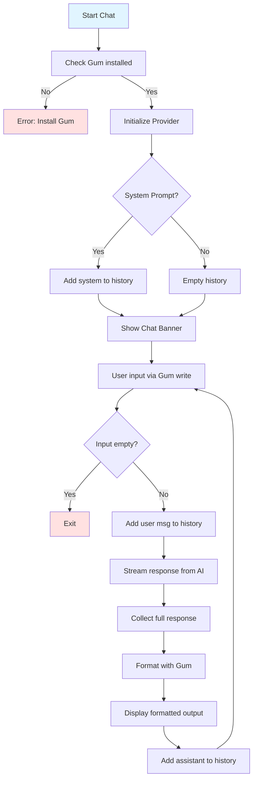

# Chat Mode

Interactive REPL for conversational AI with formatted Gum output.



## UI Cycle

```
┌─────────────────────────────────────┐
│ 💬 hiac chat mode (model: xxx)      │
│    Ctrl+D to send, Ctrl+C to exit   │
│                                      │
│ > [User types message]               │
│    Ctrl+D ↓                          │
│                                      │
│ 🤔 Thinking...                       │
│ ✅ Ready!                            │
│                                      │
│ [Gum-styled response]                │
│                                      │
│ > [Next message...]                  │
└─────────────────────────────────────┘
```

## Formatting Features

- **Width clamp**: Line wrap at 70 characters
- **ANSI preservation**: Colors/styles maintained across line breaks
- **Markdown rendering**: Headers, code blocks, bold/italic