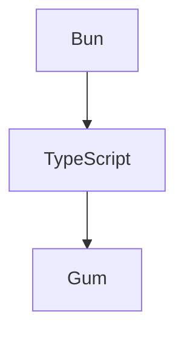

# Mermaid Diagram Extraction

Automatically extracts Mermaid diagrams from AI responses and saves to `./design/`.

```mermaid
flowchart TD
    A[AI Response] --> B[Regex Search:<br>```mermaid ...```]
    B --> C{Diagrams found?}
    C -->|No| D[Skip extraction]
    C -->|Yes| E[Extract diagram content]
    E --> F[Prepare timestamp:<br>YYYY-MM-DD_HH-mm-ss.svg]
    F --> G{./design/ exists?}
    G -->|No| H[Create directory]
    G -->|Yes| I[Skip creation]
    H --> J[Write diagram to file]
    I --> J[Write diagram to file]
    J --> K[Log count: "Extracted N diagrams"]

    D --> L[Done]
    K --> L[Done]

    style A fill:#e1f5ff
    style L fill:#e1ffe1
```

## Regex Pattern

```javascript
/```mermaid([\s\S]*?)```/g
```

Matches:
- Opening ```mermaid
- Any content (including newlines)
- Closing ```

## Naming Convention

```
./design/<timestamp>.svg

Example:
./design/2026-02-12_11-43-00.svg
./design/2026-02-12_11-43-01.svg
```

## Example

### AI Response
```markdown
Here's the architecture:



Let me know if you need changes.
```

### Extraction Results
```
📄 Extracted 1 diagram(s) to ./design/

File: ./design/2026-02-12_11-43-00.svg
Content:
flowchart TD
  A[Bun] --> B[TypeScript]
  B --> C[Gum]
```

### Future Enhancement

The extracted `.svg` files are currently just the Mermaid source code. They could be rendered using:

```bash
mmdc -i diagram.mmd -o diagram.svg
```

(mmdc = Mermaid CLI)