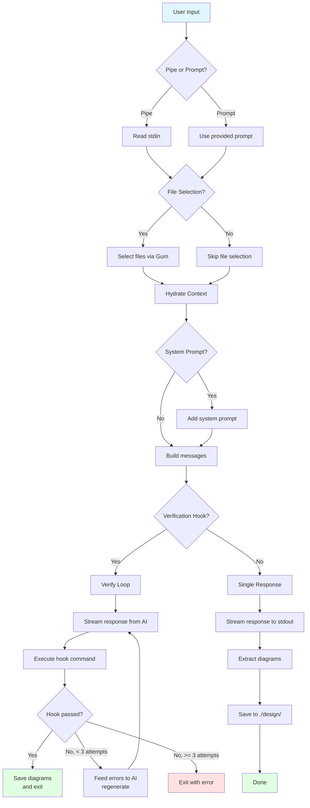

# One-Shot Mode

The one-shot mode processes a single prompt through AI with optional verification hooks and diagram extraction.

## Key Flows

### With Verification Hook
1. User provides prompt + `--hook "bun test"`
2. Generate response from AI
3. Run hook command
4. Pass → save diagrams, exit success
5. Fail → feed errors back to AI, retry (max 3 attempts)

### Without Verification Hook
1. User provides prompt (no hook)
2. Stream response to stdout
3. Extract Mermaid diagrams
4. Save to `./design/`