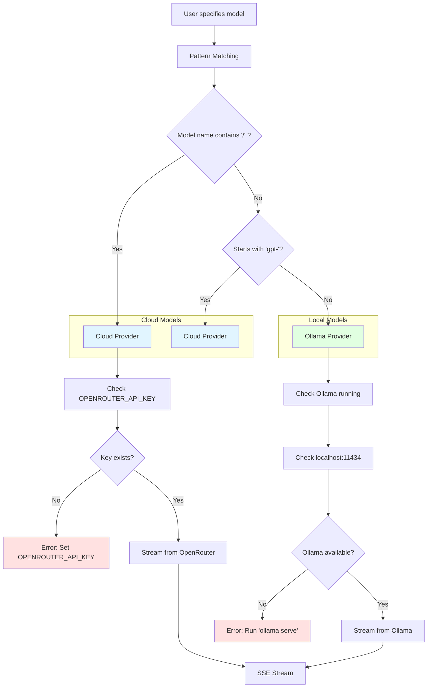

# Provider Routing

Automatic routing between local Ollama and cloud OpenRouter based on model name patterns.



## Model Routing Table

| Pattern          | Provider | Example Models        |
|------------------|----------|-----------------------|
| `anthropic/*`    | Cloud    | `claude-3-haiku`      |
| `openai/*`       | Cloud    | `gpt-4`, `gpt-4o-mini`|
| `<provider>/*`   | Cloud    | Any `/` format        |
| `gpt-*`          | Cloud    | `gpt-4`, `gpt-3.5`    |
| Other names      | Ollama   | `llama3`, `mistral`   |

## Configuration

### Cloud Provider
```bash
export OPENROUTER_API_KEY=sk-or-v1-xxx
```

### Local Provider
```bash
ollama serve  # Runs on localhost:11434
ollama pull llama3
ollama list   # See available models
```

## Discovery

### Ollama
```bash
GET /api/tags
Returns: [{ name: "llama3", size: 4096000000 }]
```

### OpenRouter
```bash
GET v1/models via API
Returns: Full catalog with pricing/routing info
```