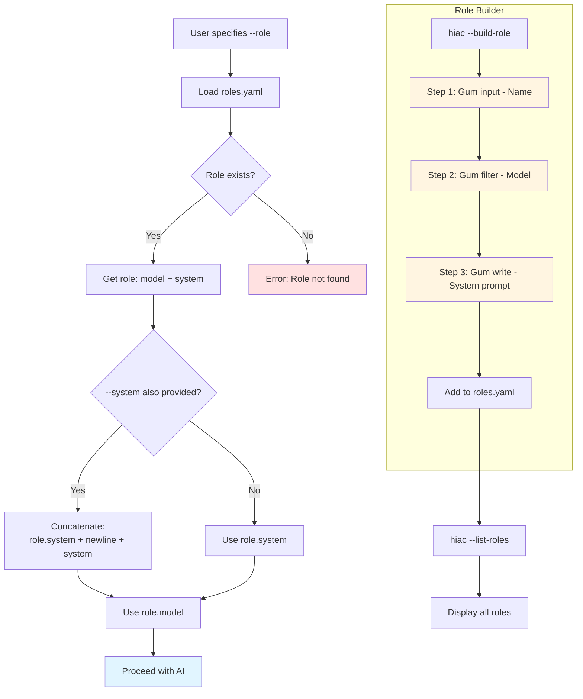

# Role System

Predefined and custom roles with model + system prompt combinations.



## Role Definition (YAML)

```yaml
roles:
  coder:
    model: kimi-k2.5:cloud
    system: |
      You are an expert software engineer...
      @file:rust-expert.md  # File reference

  reviewer:
    model: kimi-k2.5:cloud
    system: |
      You are a code reviewer...
      Focus on: security, performance, readability

  architect:
    model: gpt-4o
    system: |
      You design scalable systems...
      Consider: CAP theorem, patterns
```

## Built-in Roles

| Role    | Model               | Purpose                      |
|---------|---------------------|------------------------------|
| coder   | kimi-k2.5:cloud     | Write production code        |
| reviewer| kimi-k2.5:cloud     | Code review & feedback       |
| architect| gpt-4o              | System design & patterns     |
| explainer| kimi-k2.5:cloud    | Explain technical concepts    |
| devops  | kimi-k2.5:cloud     | CI/CD, DevOps guidance       |
| writer  | kimi-k2.5:cloud     | Documentation & prose        |
| rust    | gpt-4o              | Rust language specialist      |
| minimax | kimi-k2.5:cloud     | Minimalist code style        |

## Role Builder Questions

1. **Name**: `coder`, `reviewer`, etc.
2. **Model**: Select from Gum filter (local + cloud)
3. **System prompt**: Multi-line via Gum write

## File References

```yaml
@file:rust-expert.md

# Resolves to content of:
.hiac/prompts/rust-expert.md
```

Used for:
- Reuse common system prompts
- Modular role definitions
- Avoid repetition in `roles.yaml`