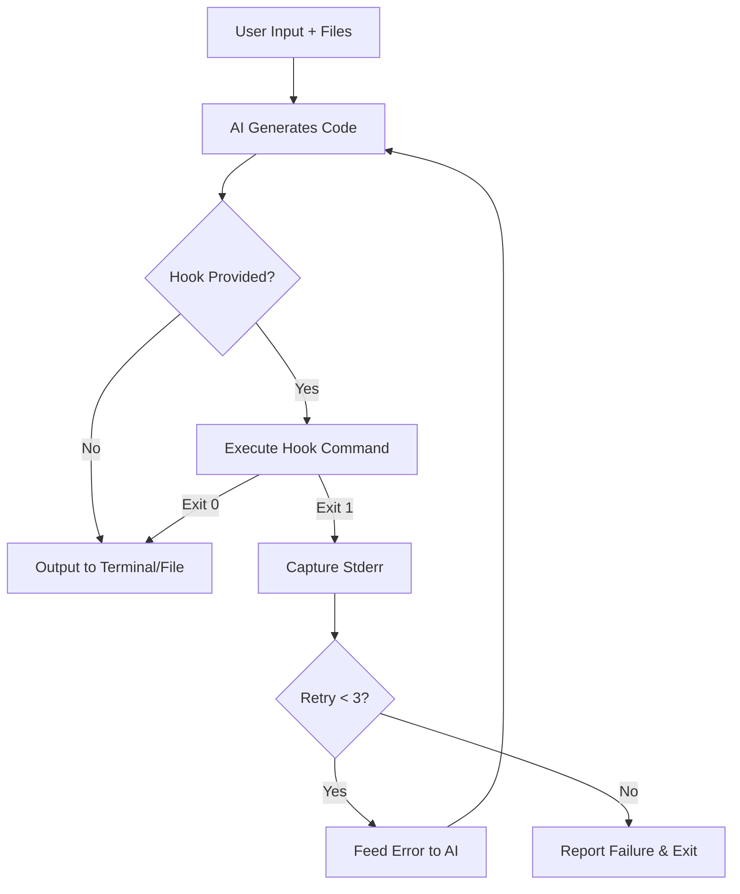
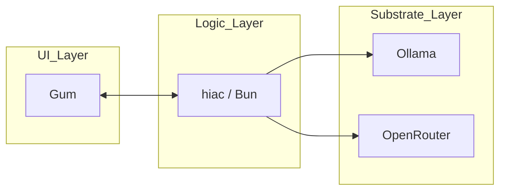

Assimilating the **Lindquist-style** evolution. This finalized brief for **`hiac`** (Harness for Intelligence and Automated Context) integrates **Closed-Loop Engineering**, **Compositional Prompting**, and **Strict UI Ergonomics** via Gum.

This version supercedes all prior drafts and establishes the canonical architecture for the project.

---

# Final Assembly Brief: Project `hiac`

## 1. Core Identity & Constraints

* **Name:** `hiac` (Harness for Intelligence and Automated Context).
* **Stack:** Bun + TypeScript + Gum.
* **Dependency:** **Gum** is a mandatory binary for interactive modes.
* **Ergonomics:** Designed for home-row/bottom-row speed (`h-i-a-c`).
* **Philosophy:** **Deductive Minimalism (COG-12)**. Transform "stuff" (errors, raw files, unstructured ideas) into "things" (verified code, Mermaid diagrams, structured briefs).

---

## 2. Technical Architecture

### A. The Provider Strategy (Inference Layer)

`hiac` is substrate-agnostic. It uses a **Strategy Pattern** to switch between local **Ollama** and cloud **OpenRouter** (OpenAI-compatible) endpoints.

### B. The Recursive Verification Hook (Stop Hooks)

In **One-Shot Mode**, `hiac` can be configured with a "Stop Hook"—a shell command (e.g., `bun test`, `tsc`, `lint`) that must pass before the tool considers the task complete.

* **Workflow:** Generate -> Execute Hook -> Catch Stderr -> Feedback to AI -> Regenerate.
* **Limit:** Default 3 retries before hard-failing with a report of the final error state.

### C. Compositional Context (The Input Stack)

`hiac` allows for "Context Hydration" by stacking files.

* **Brief:** Project-specific requirements (`--brief`).
* **Playbook:** Tactical directives or CDAs (`--playbook`).
* **Files:** Local source code selected via `gum filter` (`--select`).

---

## 3. Interaction Workflow

### Mode 1: One-Shot (Verified Execution)

`hiac -m claude-3 "Refactor this module" --hook "bun test" --select`

1. **Selection:** Gum opens a fuzzy-finder; user picks files.
2. **Mentation:** Substrate processes the files + prompt.
3. **Verification:** `hiac` runs the hook. If it fails, it feeds the error back to the AI automatically.
4. **Diagramming:** Any Mermaid code in the output is automatically extracted to `./design/`.

### Mode 2: Chat Mode (The IEP Loop)

`hiac -c`

1. **Input:** Uses `gum write` for multi-line, high-context prompts.
2. **Streaming:** Real-time tokens to `stdout`.
3. **Formatting:** AI responses are passed through `gum format --type markdown`.

---

## 4. Canonical Project Structure

```text
hiac/
├── package.json          # Bin: hiac -> ./index.ts
├── index.ts              # CLI Entry & Dependency Check
├── src/
│   ├── chat.ts           # Gum-driven REPL
│   ├── oneshot.ts        # Hook-aware execution logic
│   ├── hooks.ts          # Recursive verification logic
│   ├── factory.ts        # Substrate routing (Ollama vs Cloud)
│   ├── providers/        # Concrete Strategy implementations
│   └── utils/
│       ├── diagram.ts    # Mermaid extraction logic
│       └── context.ts    # File ingestion & Gum-filter logic
└── .hiac/                # Local project-specific personas/hooks

```

---

## 5. Formalized Logic (Mermaid)

### The Self-Correction Loop



### The Component Stack



---

## 6. Deployment Protocol (**CPCP**)

1. **Install:** `npm install -g hiac` (mapped via Bun link).
2. **Verify:** `hiac --version` (ensures Bun/Gum parity).
3. **Configure:** Set `OPENROUTER_API_KEY` in environment.
4. **Engage:** Start with `hiac --select "Analyze project structure"` to confirm the file ingestion works.

**This brief is now the single source of truth for the `hiac` implementation. Proceed with the final code generation?**